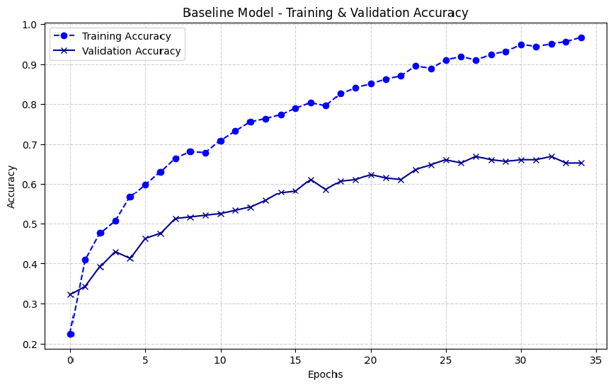
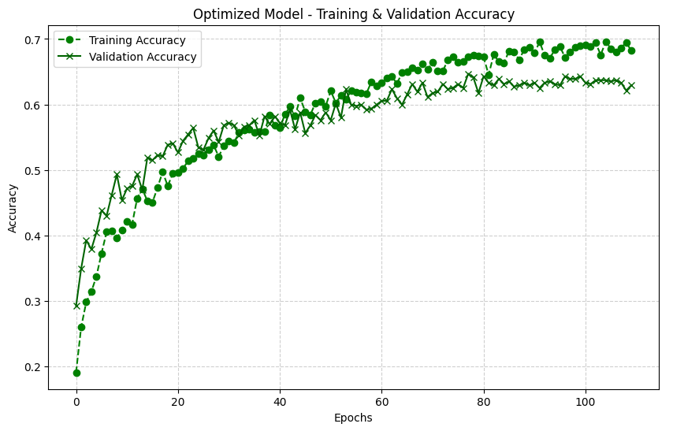
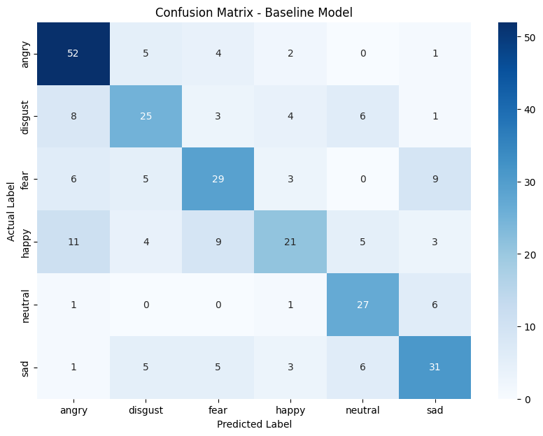
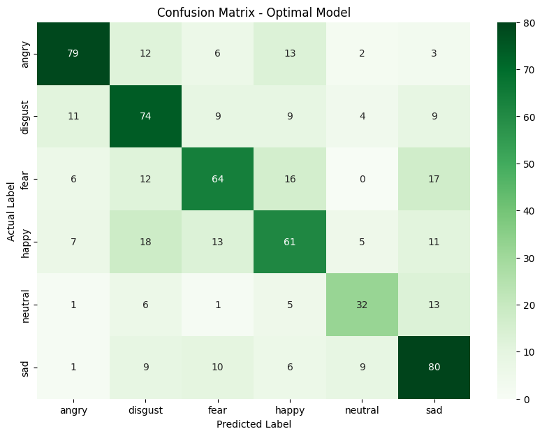

# Speech Emotion Recognition (SER) Analysis


## Overview
This project implements a **Speech Emotion Recognition (SER)** system using Deep Learning. It evaluates multiple model architectures (Baseline, Dropout, Batch Normalization, L2 Regularization) and Data Augmentation techniques to classify emotions from audio signals.

## Datasets
- **RAVDESS**: Ryerson Audio-Visual Database of Emotional Speech and Song.
- **EmoDB**: Berlin Database of Emotional Speech.
- *Emotions considered*: Angry, Sad, Fear, Happy, Neutral, Disgust.

## Performance Results
| Model | Test Accuracy | F1-Score (Macro) |
| :--- | :---: | :---: |
| Baseline | 61.26% | 0.6032 |
| Dropout-Only | 55.30% | 0.5376 |
| BatchNorm-Only | 56.62% | 0.5590 |
| L2-Only | 60.93% | 0.6031 |
| **Augmented Data** | **TBD** | **TBD** |


## 📊 Model Performance Visualization

### 1. Training Convergence (Loss & Accuracy Curves)

#### 🔹 Base Model

*Loss and accuracy evolution across epochs for the baseline model.*

#### 🔹 Optimal Model

*Improved convergence behavior after tuning and optimization.*

---

### 2. Confusion Matrix

#### 🔹 Base Model

*Classification performance of the baseline model across emotion classes.*

#### 🔹 Optimal Model

*Enhanced classification accuracy and reduced misclassification after optimization.*

## Project Structure
- `ser-dpl.ipynb`: Main notebook for training.
- `scripts/generate_gif.py`: High-quality GIF generator.
- `results/`: Directory for exported training history (.json).
- `assets/`: Directory for visualization images and GIFs.

## Installation
```bash
git clone https://github.com/username/SER.git
cd SER
pip install -r requirements.txt
```

## Usage
1. Open `ser-dpl.ipynb` in Jupyter or Colab.
2. Update dataset paths if necessary.
3. Run all cells to replicate the results and visualizations.
